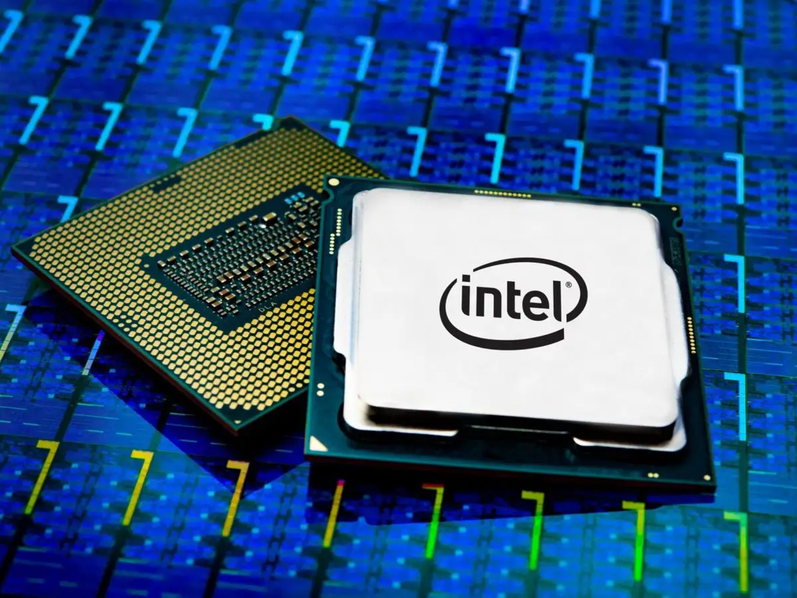
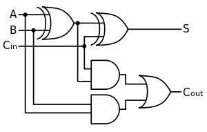
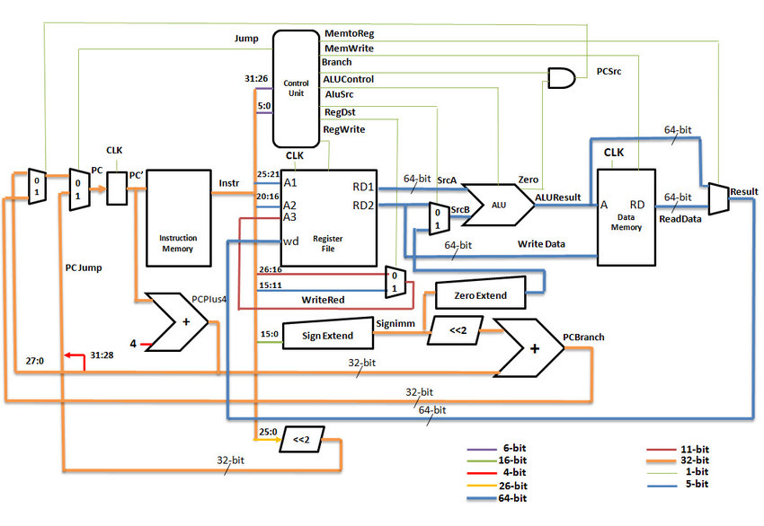

<svg class="absolute" style="left:0.0%;top:0.01%;width:4.31%;height:100.0%" viewBox="0 0 100 100" preserveAspectRatio="none"><path d="M 0,100 L 0,0 100,100 Z" fill="rgb(243,243,243)"/></svg>

<strong>LUCAS</strong>

<strong>SILVA</strong>

<strong>FIGUEIREDO</strong>

<h1 style="margin:0">Programação 1 (<strong>P1</strong>)</h1>

Portas lógicas

---

<svg class="absolute" style="left:0.0%;top:0.01%;width:4.31%;height:100.0%" viewBox="0 0 100 100" preserveAspectRatio="none"><path d="M 0,100 L 0,0 100,100 Z" fill="rgb(243,243,243)"/></svg>

<strong>LUCAS</strong>

<strong>SILVA</strong>

<strong>FIGUEIREDO</strong>

<h1 style="margin:0">processando dados binários (álgebra booleana)</h1>

---

<svg class="absolute" style="left:0.0%;top:0.01%;width:4.31%;height:100.0%" viewBox="0 0 100 100" preserveAspectRatio="none"><path d="M 0,100 L 0,0 100,100 Z" fill="rgb(243,243,243)"/></svg>

<strong>LUCAS</strong>

<strong>SILVA</strong>

<strong>FIGUEIREDO</strong>

<h1 style="margin:0">processando dados</h1>

ok, aprendemos a contar, temos um entendimento de como funciona o sistema binário.

mas computadores não são feitos somente para armazenar dados. essa é a parte da memória. computadores são especialmente interessantes por que eles <strong>processam dados</strong>

dados entram (input), são processados, e saem (output)

coisas acontecem com dados, que no nosso caso são bits

---

<svg class="absolute" style="left:0.0%;top:0.01%;width:4.31%;height:100.0%" viewBox="0 0 100 100" preserveAspectRatio="none"><path d="M 0,100 L 0,0 100,100 Z" fill="rgb(243,243,243)"/></svg>

<strong>LUCAS</strong>

<strong>SILVA</strong>

<strong>FIGUEIREDO</strong>

<h1 style="margin:0">processando dados</h1>

e na computação, quem processa dados é o processador

---

<svg class="absolute" style="left:0.0%;top:0.01%;width:4.31%;height:100.0%" viewBox="0 0 100 100" preserveAspectRatio="none"><path d="M 0,100 L 0,0 100,100 Z" fill="rgb(243,243,243)"/></svg>

<strong>LUCAS</strong>

<strong>SILVA</strong>

<strong>FIGUEIREDO</strong>

<h1 style="margin:0">processando dados</h1>

e como acontece esse processamento?  o que são esses circuitos?

---

<svg class="absolute" style="left:0.0%;top:0.01%;width:4.31%;height:100.0%" viewBox="0 0 100 100" preserveAspectRatio="none"><path d="M 0,100 L 0,0 100,100 Z" fill="rgb(243,243,243)"/></svg>

<strong>LUCAS</strong>

<strong>SILVA</strong>

<strong>FIGUEIREDO</strong>

<h1 style="margin:0">processando dados</h1>

e como acontece esse processamento?  o que são esses circuitos?

são <strong>decisões</strong> a partir de <strong>bits</strong>

---

<svg class="absolute" style="left:0.0%;top:0.01%;width:4.31%;height:100.0%" viewBox="0 0 100 100" preserveAspectRatio="none"><path d="M 0,100 L 0,0 100,100 Z" fill="rgb(243,243,243)"/></svg>

<strong>LUCAS</strong>

<strong>SILVA</strong>

<strong>FIGUEIREDO</strong>

<h1 style="margin:0">imagine que</h1>

eu tenho que tomar uma decisão. quero sair amanhã, mas só vou sair se <strong>tiver fazendo sol</strong> e <strong>eu tiver com dinheiro</strong>

<table style="width:100%;height:100%;border-collapse:collapse"><tbody><tr><td style="padding:0;vertical-align:middle">
☀
</td><td style="padding:0;vertical-align:middle">
e and &amp;
</td><td style="padding:0;vertical-align:middle">
$
</td><td style="padding:0;vertical-align:middle">
vou sair
</td></tr><tr><td style="padding:0;vertical-align:middle">
V
</td><td style="padding:0;vertical-align:middle"></td><td style="padding:0;vertical-align:middle">
V
</td><td style="padding:0;vertical-align:middle">
?
</td></tr><tr><td style="padding:0;vertical-align:middle"></td><td style="padding:0;vertical-align:middle"></td><td style="padding:0;vertical-align:middle"></td><td style="padding:0;vertical-align:middle"></td></tr><tr><td style="padding:0;vertical-align:middle"></td><td style="padding:0;vertical-align:middle"></td><td style="padding:0;vertical-align:middle"></td><td style="padding:0;vertical-align:middle"></td></tr><tr><td style="padding:0;vertical-align:middle"></td><td style="padding:0;vertical-align:middle"></td><td style="padding:0;vertical-align:middle"></td><td style="padding:0;vertical-align:middle"></td></tr></tbody></table>

<svg style="position:absolute;left:0;top:0;width:100%;height:100%;pointer-events:none;overflow:visible" viewBox="0 0 960 540"><line x1="497.9" y1="255.8" x2="844.3" y2="255.8" stroke="rgb(89,89,89)" stroke-width="1.0"/></svg>

---

<svg class="absolute" style="left:0.0%;top:0.01%;width:4.31%;height:100.0%" viewBox="0 0 100 100" preserveAspectRatio="none"><path d="M 0,100 L 0,0 100,100 Z" fill="rgb(243,243,243)"/></svg>

<strong>LUCAS</strong>

<strong>SILVA</strong>

<strong>FIGUEIREDO</strong>

<h1 style="margin:0">imagine que</h1>

eu tenho que tomar uma decisão. quero sair amanhã, mas só vou sair se <strong>tiver fazendo sol</strong> e <strong>eu tiver com dinheiro</strong>

<table style="width:100%;height:100%;border-collapse:collapse"><tbody><tr><td style="padding:0;vertical-align:middle">
☀
</td><td style="padding:0;vertical-align:middle">
e and &amp;
</td><td style="padding:0;vertical-align:middle">
$
</td><td style="padding:0;vertical-align:middle">
vou sair
</td></tr><tr><td style="padding:0;vertical-align:middle">
V
</td><td style="padding:0;vertical-align:middle"></td><td style="padding:0;vertical-align:middle">
V
</td><td style="padding:0;vertical-align:middle">
V
</td></tr><tr><td style="padding:0;vertical-align:middle">
V
</td><td style="padding:0;vertical-align:middle"></td><td style="padding:0;vertical-align:middle">
F
</td><td style="padding:0;vertical-align:middle">
?
</td></tr><tr><td style="padding:0;vertical-align:middle">
F
</td><td style="padding:0;vertical-align:middle"></td><td style="padding:0;vertical-align:middle">
V
</td><td style="padding:0;vertical-align:middle">
?
</td></tr><tr><td style="padding:0;vertical-align:middle">
F
</td><td style="padding:0;vertical-align:middle"></td><td style="padding:0;vertical-align:middle">
F
</td><td style="padding:0;vertical-align:middle">
?
</td></tr></tbody></table>

<svg style="position:absolute;left:0;top:0;width:100%;height:100%;pointer-events:none;overflow:visible" viewBox="0 0 960 540"><line x1="497.9" y1="255.8" x2="844.3" y2="255.8" stroke="rgb(89,89,89)" stroke-width="1.0"/></svg>

---

<svg class="absolute" style="left:0.0%;top:0.01%;width:4.31%;height:100.0%" viewBox="0 0 100 100" preserveAspectRatio="none"><path d="M 0,100 L 0,0 100,100 Z" fill="rgb(243,243,243)"/></svg>

<strong>LUCAS</strong>

<strong>SILVA</strong>

<strong>FIGUEIREDO</strong>

<h1 style="margin:0">imagine que</h1>

eu tenho que tomar uma decisão. quero sair amanhã, mas só vou sair se <strong>tiver fazendo sol</strong> e <strong>eu tiver com dinheiro</strong>

<table style="width:100%;height:100%;border-collapse:collapse"><tbody><tr><td style="padding:0;vertical-align:middle">
☀
</td><td style="padding:0;vertical-align:middle">
e and &amp;
</td><td style="padding:0;vertical-align:middle">
$
</td><td style="padding:0;vertical-align:middle">
vou sair
</td></tr><tr><td style="padding:0;vertical-align:middle">
V
</td><td style="padding:0;vertical-align:middle"></td><td style="padding:0;vertical-align:middle">
V
</td><td style="padding:0;vertical-align:middle">
V
</td></tr><tr><td style="padding:0;vertical-align:middle">
V
</td><td style="padding:0;vertical-align:middle"></td><td style="padding:0;vertical-align:middle">
F
</td><td style="padding:0;vertical-align:middle">
F
</td></tr><tr><td style="padding:0;vertical-align:middle">
F
</td><td style="padding:0;vertical-align:middle"></td><td style="padding:0;vertical-align:middle">
V
</td><td style="padding:0;vertical-align:middle">
F
</td></tr><tr><td style="padding:0;vertical-align:middle">
F
</td><td style="padding:0;vertical-align:middle"></td><td style="padding:0;vertical-align:middle">
F
</td><td style="padding:0;vertical-align:middle">
F
</td></tr></tbody></table>

<svg style="position:absolute;left:0;top:0;width:100%;height:100%;pointer-events:none;overflow:visible" viewBox="0 0 960 540"><line x1="497.9" y1="255.8" x2="844.3" y2="255.8" stroke="rgb(89,89,89)" stroke-width="1.0"/></svg>

---

<svg class="absolute" style="left:0.0%;top:0.01%;width:4.31%;height:100.0%" viewBox="0 0 100 100" preserveAspectRatio="none"><path d="M 0,100 L 0,0 100,100 Z" fill="rgb(243,243,243)"/></svg>

<strong>LUCAS</strong>

<strong>SILVA</strong>

<strong>FIGUEIREDO</strong>

eu tenho que tomar uma decisão. quero sair amanhã, mas só vou sair se <strong>tiver fazendo sol</strong> e <strong>eu tiver com dinheiro</strong>

<table style="width:100%;height:100%;border-collapse:collapse"><tbody><tr><td style="padding:0;vertical-align:middle">
☀
</td><td style="padding:0;vertical-align:middle">
e and &amp;
</td><td style="padding:0;vertical-align:middle">
$
</td><td style="padding:0;vertical-align:middle">
vou sair
</td></tr><tr><td style="padding:0;vertical-align:middle">
1
</td><td style="padding:0;vertical-align:middle"></td><td style="padding:0;vertical-align:middle">
1
</td><td style="padding:0;vertical-align:middle">
1
</td></tr><tr><td style="padding:0;vertical-align:middle">
1
</td><td style="padding:0;vertical-align:middle"></td><td style="padding:0;vertical-align:middle">
0
</td><td style="padding:0;vertical-align:middle">
0
</td></tr><tr><td style="padding:0;vertical-align:middle">
0
</td><td style="padding:0;vertical-align:middle"></td><td style="padding:0;vertical-align:middle">
1
</td><td style="padding:0;vertical-align:middle">
0
</td></tr><tr><td style="padding:0;vertical-align:middle">
0
</td><td style="padding:0;vertical-align:middle"></td><td style="padding:0;vertical-align:middle">
0
</td><td style="padding:0;vertical-align:middle">
0
</td></tr></tbody></table>

<svg style="position:absolute;left:0;top:0;width:100%;height:100%;pointer-events:none;overflow:visible" viewBox="0 0 960 540"><line x1="497.9" y1="255.8" x2="844.3" y2="255.8" stroke="rgb(89,89,89)" stroke-width="1.0"/></svg>

<h1 style="margin:0">operação <strong>and</strong></h1>

---

<svg class="absolute" style="left:0.0%;top:0.01%;width:4.31%;height:100.0%" viewBox="0 0 100 100" preserveAspectRatio="none"><path d="M 0,100 L 0,0 100,100 Z" fill="rgb(243,243,243)"/></svg>

<strong>LUCAS</strong>

<strong>SILVA</strong>

<strong>FIGUEIREDO</strong>

pra piorar, ou melhorar, descobri que tem um forró na praia… só vou pro forró hoje se um dos meus amigos forem, se

<strong>java </strong>ou <strong>ralph </strong>forem pro forró eu vou

<table style="width:100%;height:100%;border-collapse:collapse"><tbody><tr><td style="padding:0;vertical-align:middle">
🛉 java
</td><td style="padding:0;vertical-align:middle">
ou or |
</td><td style="padding:0;vertical-align:middle">
🛉 ralph
</td><td style="padding:0;vertical-align:middle">
vou sair
</td></tr><tr><td style="padding:0;vertical-align:middle">
1
</td><td style="padding:0;vertical-align:middle"></td><td style="padding:0;vertical-align:middle">
1
</td><td style="padding:0;vertical-align:middle">
?
</td></tr><tr><td style="padding:0;vertical-align:middle">
1
</td><td style="padding:0;vertical-align:middle"></td><td style="padding:0;vertical-align:middle">
0
</td><td style="padding:0;vertical-align:middle">
?
</td></tr><tr><td style="padding:0;vertical-align:middle">
0
</td><td style="padding:0;vertical-align:middle"></td><td style="padding:0;vertical-align:middle">
1
</td><td style="padding:0;vertical-align:middle">
?
</td></tr><tr><td style="padding:0;vertical-align:middle">
0
</td><td style="padding:0;vertical-align:middle"></td><td style="padding:0;vertical-align:middle">
0
</td><td style="padding:0;vertical-align:middle">
?
</td></tr></tbody></table>

<svg style="position:absolute;left:0;top:0;width:100%;height:100%;pointer-events:none;overflow:visible" viewBox="0 0 960 540"><line x1="497.9" y1="255.8" x2="844.3" y2="255.8" stroke="rgb(89,89,89)" stroke-width="1.0"/></svg>

<h1 style="margin:0">operação <strong>or</strong></h1>

---

<svg class="absolute" style="left:0.0%;top:0.01%;width:4.31%;height:100.0%" viewBox="0 0 100 100" preserveAspectRatio="none"><path d="M 0,100 L 0,0 100,100 Z" fill="rgb(243,243,243)"/></svg>

<strong>LUCAS</strong>

<strong>SILVA</strong>

<strong>FIGUEIREDO</strong>

pra piorar, ou melhorar, descobri que tem um forró na praia… só vou pro forró hoje se um dos meus amigos forem, se

<strong>java </strong>ou <strong>ralph </strong>forem pro forró eu vou

<table style="width:100%;height:100%;border-collapse:collapse"><tbody><tr><td style="padding:0;vertical-align:middle">
🛉 java
</td><td style="padding:0;vertical-align:middle">
ou or |
</td><td style="padding:0;vertical-align:middle">
🛉 ralph
</td><td style="padding:0;vertical-align:middle">
vou sair
</td></tr><tr><td style="padding:0;vertical-align:middle">
1
</td><td style="padding:0;vertical-align:middle"></td><td style="padding:0;vertical-align:middle">
1
</td><td style="padding:0;vertical-align:middle">
1
</td></tr><tr><td style="padding:0;vertical-align:middle">
1
</td><td style="padding:0;vertical-align:middle"></td><td style="padding:0;vertical-align:middle">
0
</td><td style="padding:0;vertical-align:middle">
1
</td></tr><tr><td style="padding:0;vertical-align:middle">
0
</td><td style="padding:0;vertical-align:middle"></td><td style="padding:0;vertical-align:middle">
1
</td><td style="padding:0;vertical-align:middle">
1
</td></tr><tr><td style="padding:0;vertical-align:middle">
0
</td><td style="padding:0;vertical-align:middle"></td><td style="padding:0;vertical-align:middle">
0
</td><td style="padding:0;vertical-align:middle">
0
</td></tr></tbody></table>

<svg style="position:absolute;left:0;top:0;width:100%;height:100%;pointer-events:none;overflow:visible" viewBox="0 0 960 540"><line x1="497.9" y1="255.8" x2="844.3" y2="255.8" stroke="rgb(89,89,89)" stroke-width="1.0"/></svg>

<h1 style="margin:0">operação <strong>or</strong></h1>

---

<svg class="absolute" style="left:0.0%;top:0.01%;width:4.31%;height:100.0%" viewBox="0 0 100 100" preserveAspectRatio="none"><path d="M 0,100 L 0,0 100,100 Z" fill="rgb(243,243,243)"/></svg>

<strong>LUCAS</strong>

<strong>SILVA</strong>

<strong>FIGUEIREDO</strong>

o pior é que ralph tá paquerando duas meninas, ele disse só vai pro forró se uma das duas forem. mas se as duas forem aí ele acha melhor não ir. aí ralph vai só se

<strong>ana</strong>

ou exclusivamente

<strong>marília</strong>

forem pro forró

<table style="width:100%;height:100%;border-collapse:collapse"><tbody><tr><td style="padding:0;vertical-align:middle">
🛊 ana
</td><td style="padding:0;vertical-align:middle">
ou exclusivo xor ^
</td><td style="padding:0;vertical-align:middle">
🛊 marília
</td><td style="padding:0;vertical-align:middle">
ralph vai
</td></tr><tr><td style="padding:0;vertical-align:middle">
1
</td><td style="padding:0;vertical-align:middle"></td><td style="padding:0;vertical-align:middle">
1
</td><td style="padding:0;vertical-align:middle">
?
</td></tr><tr><td style="padding:0;vertical-align:middle">
1
</td><td style="padding:0;vertical-align:middle"></td><td style="padding:0;vertical-align:middle">
0
</td><td style="padding:0;vertical-align:middle">
?
</td></tr><tr><td style="padding:0;vertical-align:middle">
0
</td><td style="padding:0;vertical-align:middle"></td><td style="padding:0;vertical-align:middle">
1
</td><td style="padding:0;vertical-align:middle">
?
</td></tr><tr><td style="padding:0;vertical-align:middle">
0
</td><td style="padding:0;vertical-align:middle"></td><td style="padding:0;vertical-align:middle">
0
</td><td style="padding:0;vertical-align:middle">
?
</td></tr></tbody></table>

<svg style="position:absolute;left:0;top:0;width:100%;height:100%;pointer-events:none;overflow:visible" viewBox="0 0 960 540"><line x1="497.9" y1="255.8" x2="844.3" y2="255.8" stroke="rgb(89,89,89)" stroke-width="1.0"/></svg>

<h1 style="margin:0">operação <strong>xor</strong></h1>

---

<svg class="absolute" style="left:0.0%;top:0.01%;width:4.31%;height:100.0%" viewBox="0 0 100 100" preserveAspectRatio="none"><path d="M 0,100 L 0,0 100,100 Z" fill="rgb(243,243,243)"/></svg>

<strong>LUCAS</strong>

<strong>SILVA</strong>

<strong>FIGUEIREDO</strong>

o pior é que ralph tá paquerando duas meninas, ele disse só vai pro forró se uma das duas forem. mas se as duas forem aí ele acha melhor não ir. aí ralph vai só se

<strong>ana</strong>

ou exclusivamente

<strong>marília</strong>

forem pro forró

<table style="width:100%;height:100%;border-collapse:collapse"><tbody><tr><td style="padding:0;vertical-align:middle">
🛊 ana
</td><td style="padding:0;vertical-align:middle">
ou exclusivo xor ^
</td><td style="padding:0;vertical-align:middle">
🛊 marília
</td><td style="padding:0;vertical-align:middle">
ralph vai
</td></tr><tr><td style="padding:0;vertical-align:middle">
1
</td><td style="padding:0;vertical-align:middle"></td><td style="padding:0;vertical-align:middle">
1
</td><td style="padding:0;vertical-align:middle">
0
</td></tr><tr><td style="padding:0;vertical-align:middle">
1
</td><td style="padding:0;vertical-align:middle"></td><td style="padding:0;vertical-align:middle">
0
</td><td style="padding:0;vertical-align:middle">
1
</td></tr><tr><td style="padding:0;vertical-align:middle">
0
</td><td style="padding:0;vertical-align:middle"></td><td style="padding:0;vertical-align:middle">
1
</td><td style="padding:0;vertical-align:middle">
1
</td></tr><tr><td style="padding:0;vertical-align:middle">
0
</td><td style="padding:0;vertical-align:middle"></td><td style="padding:0;vertical-align:middle">
0
</td><td style="padding:0;vertical-align:middle">
0
</td></tr></tbody></table>

<svg style="position:absolute;left:0;top:0;width:100%;height:100%;pointer-events:none;overflow:visible" viewBox="0 0 960 540"><line x1="497.9" y1="255.8" x2="844.3" y2="255.8" stroke="rgb(89,89,89)" stroke-width="1.0"/></svg>

<h1 style="margin:0">operação <strong>xor</strong></h1>

---

<svg class="absolute" style="left:0.0%;top:0.01%;width:4.31%;height:100.0%" viewBox="0 0 100 100" preserveAspectRatio="none"><path d="M 0,100 L 0,0 100,100 Z" fill="rgb(243,243,243)"/></svg>

<strong>LUCAS</strong>

<strong>SILVA</strong>

<strong>FIGUEIREDO</strong>

<h1 style="margin:0">resumindo</h1>

<ul>
<li style="margin:0">eu descobri um dinheiro num bolso de uma calça guardada</li>
<li style="margin:0">vi a previsão do tempo e não vai chover</li>
<li style="margin:0">java me disse que não vai poder sair por que tem que estudar</li>
<li style="margin:0">ralph descobriu que ana vai, mas marília tá viajando</li>
</ul>

eu vou pro forró na praia?

---

<svg class="absolute" style="left:0.0%;top:0.01%;width:4.31%;height:100.0%" viewBox="0 0 100 100" preserveAspectRatio="none"><path d="M 0,100 L 0,0 100,100 Z" fill="rgb(243,243,243)"/></svg>

<strong>LUCAS</strong>

<strong>SILVA</strong>

<strong>FIGUEIREDO</strong>

<h1 style="margin:0">resumindo</h1>

<ul>
<li style="margin:0">eu descobri um dinheiro num bolso de uma calça guardada</li>
<li style="margin:0">vi a previsão do tempo e não vai chover</li>
<li style="margin:0">java me disse que não vai poder sair por que tem que estudar</li>
<li style="margin:0">ralph descobriu que ana vai, mas marília tá viajando</li>
</ul>

eu vou pro forró na praia?

(<strong>sol</strong> &amp; <strong>dinheiro</strong>) &amp; (<strong>java</strong> | <strong>ralph</strong>)

---

<svg class="absolute" style="left:0.0%;top:0.01%;width:4.31%;height:100.0%" viewBox="0 0 100 100" preserveAspectRatio="none"><path d="M 0,100 L 0,0 100,100 Z" fill="rgb(243,243,243)"/></svg>

<strong>LUCAS</strong>

<strong>SILVA</strong>

<strong>FIGUEIREDO</strong>

<h1 style="margin:0">resumindo</h1>

<ul>
<li style="margin:0">eu descobri um dinheiro num bolso de uma calça guardada</li>
<li style="margin:0">vi a previsão do tempo e não vai chover</li>
<li style="margin:0">java me disse que não vai poder sair por que tem que estudar</li>
<li style="margin:0">ralph descobriu que ana vai, mas marília tá viajando</li>
</ul>

eu vou pro forró na praia?

(<strong>sol</strong> &amp; <strong>dinheiro</strong>) &amp; (<strong>java</strong> | <strong>ralph</strong>)

se <strong>ralph </strong>= (<strong>ana</strong> ^ <strong>marília</strong>)

---

<svg class="absolute" style="left:0.0%;top:0.01%;width:4.31%;height:100.0%" viewBox="0 0 100 100" preserveAspectRatio="none"><path d="M 0,100 L 0,0 100,100 Z" fill="rgb(243,243,243)"/></svg>

<strong>LUCAS</strong>

<strong>SILVA</strong>

<strong>FIGUEIREDO</strong>

<h1 style="margin:0">resumindo</h1>

<ul>
<li style="margin:0">eu descobri um dinheiro num bolso de uma calça guardada</li>
<li style="margin:0">vi a previsão do tempo e não vai chover</li>
<li style="margin:0">java me disse que não vai poder sair por que tem que estudar</li>
<li style="margin:0">ralph descobriu que ana vai, mas marília tá viajando</li>
</ul>

eu vou pro forró na praia?

(<strong>sol</strong> &amp; <strong>dinheiro</strong>) &amp; (<strong>java</strong> | <strong>ralph</strong>)

se <strong>ralph </strong>= (<strong>ana</strong> ^ <strong>marília</strong>)

(<strong>sol</strong> &amp; <strong>dinheiro</strong>) &amp; (<strong>java</strong> | (<strong>ana</strong> ^ <strong>marília</strong>))

---

<svg class="absolute" style="left:0.0%;top:0.01%;width:4.31%;height:100.0%" viewBox="0 0 100 100" preserveAspectRatio="none"><path d="M 0,100 L 0,0 100,100 Z" fill="rgb(243,243,243)"/></svg>

<strong>LUCAS</strong>

<strong>SILVA</strong>

<strong>FIGUEIREDO</strong>

<h1 style="margin:0">resumindo</h1>

<ul>
<li style="margin:0">eu descobri um dinheiro num bolso de uma calça guardada</li>
<li style="margin:0">vi a previsão do tempo e não vai chover</li>
<li style="margin:0">java me disse que não vai poder sair por que tem que estudar</li>
<li style="margin:0">ralph descobriu que ana vai, mas marília tá viajando</li>
</ul>

eu vou pro forró na praia?

(<strong>sol</strong> &amp; <strong>dinheiro</strong>) &amp; (<strong>java</strong> | <strong>ralph</strong>)

se <strong>ralph </strong>= (<strong>ana</strong> ^ <strong>marília</strong>)

(<strong>sol</strong> &amp; <strong>dinheiro</strong>) &amp; (<strong>java</strong> | (<strong>ana</strong> ^ <strong>marília</strong>))

(  <strong>1</strong><strong> </strong> &amp;        <strong>1</strong>       ) &amp; (   <strong>0</strong>   |  (   <strong>1</strong>   ^        <strong>0</strong>     ))

---

<svg class="absolute" style="left:0.0%;top:0.01%;width:4.31%;height:100.0%" viewBox="0 0 100 100" preserveAspectRatio="none"><path d="M 0,100 L 0,0 100,100 Z" fill="rgb(243,243,243)"/></svg>

<strong>LUCAS</strong>

<strong>SILVA</strong>

<strong>FIGUEIREDO</strong>

<h1 style="margin:0">circuitos e portas lógicas</h1>

---

<svg class="absolute" style="left:0.0%;top:0.01%;width:4.31%;height:100.0%" viewBox="0 0 100 100" preserveAspectRatio="none"><path d="M 0,100 L 0,0 100,100 Z" fill="rgb(243,243,243)"/></svg>

<strong>LUCAS</strong>

<strong>SILVA</strong>

<strong>FIGUEIREDO</strong>

<h1 style="margin:0">portas lógicas</h1>

portas lógicas são a entidade de decisão (processamento) mais básica existente.

é o componente do circuito que a partir de um ou dois fios de entrada, decide se passa energia para o fio de saída

a seguir exemplos de portas lógicas

---

<svg class="absolute" style="left:0.0%;top:0.01%;width:4.31%;height:100.0%" viewBox="0 0 100 100" preserveAspectRatio="none"><path d="M 0,100 L 0,0 100,100 Z" fill="rgb(243,243,243)"/></svg>

<strong>LUCAS</strong>

<strong>SILVA</strong>

<strong>FIGUEIREDO</strong>

<h1 style="margin:0">portas lógicas : <strong>and</strong></h1>

<svg style="position:absolute;left:0;top:0;width:100%;height:100%;pointer-events:none;overflow:visible" viewBox="0 0 960 540"><defs><marker id="e_0_388" viewBox="0 0 10 10" refX="9" refY="5" markerWidth="24" markerHeight="24" markerUnits="userSpaceOnUse" orient="auto"><path d="M0,0 L10,5 L0,10z" fill="rgb(60,120,216)"/></marker></defs><line x1="32.7" y1="272.6" x2="480.0" y2="272.6" stroke="rgb(60,120,216)" stroke-width="4.0" marker-end="url(#e_0_388)"/></svg>
<svg style="position:absolute;left:0;top:0;width:100%;height:100%;pointer-events:none;overflow:visible" viewBox="0 0 960 540"><defs><marker id="e_0_389" viewBox="0 0 10 10" refX="9" refY="5" markerWidth="24" markerHeight="24" markerUnits="userSpaceOnUse" orient="auto"><path d="M0,0 L10,5 L0,10z" fill="rgb(183,183,183)"/></marker></defs><line x1="32.7" y1="343.7" x2="480.0" y2="343.7" stroke="rgb(183,183,183)" stroke-width="4.0" marker-end="url(#e_0_389)"/></svg>
<svg class="absolute" style="left:6.57%;top:49.35%;width:42.12%;height:7.73%;transform-origin:0 0;transform:rotate(-5.16deg)" viewBox="0 0 100 100" preserveAspectRatio="none"><path d="M 34.6,0 L 12.3,56 31.7,56 0,100 69.3,44 49.9,44 80.3,0 Z" fill="rgb(25,188,255)" stroke="rgb(66,133,244)" stroke-width="0.8"/></svg>

<strong>and</strong>

<svg style="position:absolute;left:0;top:0;width:100%;height:100%;pointer-events:none;overflow:visible" viewBox="0 0 960 540"><defs><marker id="e_0_394" viewBox="0 0 10 10" refX="9" refY="5" markerWidth="24" markerHeight="24" markerUnits="userSpaceOnUse" orient="auto"><path d="M0,0 L10,5 L0,10z" fill="rgb(183,183,183)"/></marker></defs><line x1="597.0" y1="304.8" x2="930.6" y2="304.8" stroke="rgb(183,183,183)" stroke-width="4.0" marker-end="url(#e_0_394)"/></svg>

---

<svg class="absolute" style="left:0.0%;top:0.01%;width:4.31%;height:100.0%" viewBox="0 0 100 100" preserveAspectRatio="none"><path d="M 0,100 L 0,0 100,100 Z" fill="rgb(243,243,243)"/></svg>

<strong>LUCAS</strong>

<strong>SILVA</strong>

<strong>FIGUEIREDO</strong>

<h1 style="margin:0">portas lógicas : <strong>and</strong></h1>

<svg style="position:absolute;left:0;top:0;width:100%;height:100%;pointer-events:none;overflow:visible" viewBox="0 0 960 540"><defs><marker id="e_0_404" viewBox="0 0 10 10" refX="9" refY="5" markerWidth="24" markerHeight="24" markerUnits="userSpaceOnUse" orient="auto"><path d="M0,0 L10,5 L0,10z" fill="rgb(60,120,216)"/></marker></defs><line x1="32.7" y1="272.6" x2="480.0" y2="272.6" stroke="rgb(60,120,216)" stroke-width="4.0" marker-end="url(#e_0_404)"/></svg>
<svg style="position:absolute;left:0;top:0;width:100%;height:100%;pointer-events:none;overflow:visible" viewBox="0 0 960 540"><defs><marker id="e_0_405" viewBox="0 0 10 10" refX="9" refY="5" markerWidth="24" markerHeight="24" markerUnits="userSpaceOnUse" orient="auto"><path d="M0,0 L10,5 L0,10z" fill="rgb(183,183,183)"/></marker></defs><line x1="32.7" y1="343.7" x2="480.0" y2="343.7" stroke="rgb(183,183,183)" stroke-width="4.0" marker-end="url(#e_0_405)"/></svg>
<svg class="absolute" style="left:6.57%;top:49.35%;width:42.12%;height:7.73%;transform-origin:0 0;transform:rotate(-5.16deg)" viewBox="0 0 100 100" preserveAspectRatio="none"><path d="M 34.6,0 L 12.3,56 31.7,56 0,100 69.3,44 49.9,44 80.3,0 Z" fill="rgb(25,188,255)" stroke="rgb(66,133,244)" stroke-width="0.8"/></svg>

<strong>and</strong>

<svg style="position:absolute;left:0;top:0;width:100%;height:100%;pointer-events:none;overflow:visible" viewBox="0 0 960 540"><defs><marker id="e_0_410" viewBox="0 0 10 10" refX="9" refY="5" markerWidth="24" markerHeight="24" markerUnits="userSpaceOnUse" orient="auto"><path d="M0,0 L10,5 L0,10z" fill="rgb(183,183,183)"/></marker></defs><line x1="597.0" y1="304.8" x2="930.6" y2="304.8" stroke="rgb(183,183,183)" stroke-width="4.0" marker-end="url(#e_0_410)"/></svg>

---

<svg class="absolute" style="left:0.0%;top:0.01%;width:4.31%;height:100.0%" viewBox="0 0 100 100" preserveAspectRatio="none"><path d="M 0,100 L 0,0 100,100 Z" fill="rgb(243,243,243)"/></svg>

<strong>LUCAS</strong>

<strong>SILVA</strong>

<strong>FIGUEIREDO</strong>

<h1 style="margin:0">portas lógicas : <strong>or</strong></h1>

<svg style="position:absolute;left:0;top:0;width:100%;height:100%;pointer-events:none;overflow:visible" viewBox="0 0 960 540"><defs><marker id="e_0_421" viewBox="0 0 10 10" refX="9" refY="5" markerWidth="24" markerHeight="24" markerUnits="userSpaceOnUse" orient="auto"><path d="M0,0 L10,5 L0,10z" fill="rgb(60,120,216)"/></marker></defs><line x1="32.7" y1="272.6" x2="506.6" y2="272.6" stroke="rgb(60,120,216)" stroke-width="4.0" marker-end="url(#e_0_421)"/></svg>
<svg style="position:absolute;left:0;top:0;width:100%;height:100%;pointer-events:none;overflow:visible" viewBox="0 0 960 540"><defs><marker id="e_0_422" viewBox="0 0 10 10" refX="9" refY="5" markerWidth="24" markerHeight="24" markerUnits="userSpaceOnUse" orient="auto"><path d="M0,0 L10,5 L0,10z" fill="rgb(183,183,183)"/></marker></defs><line x1="32.7" y1="343.7" x2="506.6" y2="343.7" stroke="rgb(183,183,183)" stroke-width="4.0" marker-end="url(#e_0_422)"/></svg>
<svg class="absolute" style="left:6.57%;top:49.35%;width:42.12%;height:7.73%;transform-origin:0 0;transform:rotate(-5.16deg)" viewBox="0 0 100 100" preserveAspectRatio="none"><path d="M 34.6,0 L 12.3,56 31.7,56 0,100 69.3,44 49.9,44 80.3,0 Z" fill="rgb(25,188,255)" stroke="rgb(66,133,244)" stroke-width="0.8"/></svg>
<svg style="position:absolute;left:0;top:0;width:100%;height:100%;pointer-events:none;overflow:visible" viewBox="0 0 960 540"><defs><marker id="e_0_429" viewBox="0 0 10 10" refX="9" refY="5" markerWidth="24" markerHeight="24" markerUnits="userSpaceOnUse" orient="auto"><path d="M0,0 L10,5 L0,10z" fill="rgb(60,120,216)"/></marker></defs><line x1="597.0" y1="304.8" x2="930.6" y2="304.8" stroke="rgb(60,120,216)" stroke-width="4.0" marker-end="url(#e_0_429)"/></svg>
<svg class="absolute" style="left:62.89%;top:55.3%;width:30.86%;height:7.73%;transform-origin:0 0;transform:rotate(-7.00deg)" viewBox="0 0 100 100" preserveAspectRatio="none"><path d="M 34.6,0 L 12.3,56 31.7,56 0,100 69.3,44 49.9,44 80.3,0 Z" fill="rgb(25,188,255)" stroke="rgb(66,133,244)" stroke-width="0.8"/></svg>

---

<svg class="absolute" style="left:0.0%;top:0.01%;width:4.31%;height:100.0%" viewBox="0 0 100 100" preserveAspectRatio="none"><path d="M 0,100 L 0,0 100,100 Z" fill="rgb(243,243,243)"/></svg>

<strong>LUCAS</strong>

<strong>SILVA</strong>

<strong>FIGUEIREDO</strong>

<h1 style="margin:0">portas lógicas : x <strong>or</strong></h1>

<svg style="position:absolute;left:0;top:0;width:100%;height:100%;pointer-events:none;overflow:visible" viewBox="0 0 960 540"><defs><marker id="e_0_438" viewBox="0 0 10 10" refX="9" refY="5" markerWidth="24" markerHeight="24" markerUnits="userSpaceOnUse" orient="auto"><path d="M0,0 L10,5 L0,10z" fill="rgb(60,120,216)"/></marker></defs><line x1="32.7" y1="272.6" x2="506.6" y2="272.6" stroke="rgb(60,120,216)" stroke-width="4.0" marker-end="url(#e_0_438)"/></svg>
<svg style="position:absolute;left:0;top:0;width:100%;height:100%;pointer-events:none;overflow:visible" viewBox="0 0 960 540"><defs><marker id="e_0_439" viewBox="0 0 10 10" refX="9" refY="5" markerWidth="24" markerHeight="24" markerUnits="userSpaceOnUse" orient="auto"><path d="M0,0 L10,5 L0,10z" fill="rgb(183,183,183)"/></marker></defs><line x1="32.7" y1="343.7" x2="506.6" y2="343.7" stroke="rgb(183,183,183)" stroke-width="4.0" marker-end="url(#e_0_439)"/></svg>
<svg class="absolute" style="left:6.57%;top:49.35%;width:42.12%;height:7.73%;transform-origin:0 0;transform:rotate(-5.16deg)" viewBox="0 0 100 100" preserveAspectRatio="none"><path d="M 34.6,0 L 12.3,56 31.7,56 0,100 69.3,44 49.9,44 80.3,0 Z" fill="rgb(25,188,255)" stroke="rgb(66,133,244)" stroke-width="0.8"/></svg>
<svg style="position:absolute;left:0;top:0;width:100%;height:100%;pointer-events:none;overflow:visible" viewBox="0 0 960 540"><line x1="474.0" y1="249.5" x2="506.8" y2="357.8" stroke="rgb(103,78,167)" stroke-width="4.0"/></svg>
<svg style="position:absolute;left:0;top:0;width:100%;height:100%;pointer-events:none;overflow:visible" viewBox="0 0 960 540"><defs><marker id="e_0_448" viewBox="0 0 10 10" refX="9" refY="5" markerWidth="24" markerHeight="24" markerUnits="userSpaceOnUse" orient="auto"><path d="M0,0 L10,5 L0,10z" fill="rgb(60,120,216)"/></marker></defs><line x1="597.0" y1="304.8" x2="930.6" y2="304.8" stroke="rgb(60,120,216)" stroke-width="4.0" marker-end="url(#e_0_448)"/></svg>
<svg class="absolute" style="left:62.89%;top:55.3%;width:30.86%;height:7.73%;transform-origin:0 0;transform:rotate(-7.00deg)" viewBox="0 0 100 100" preserveAspectRatio="none"><path d="M 34.6,0 L 12.3,56 31.7,56 0,100 69.3,44 49.9,44 80.3,0 Z" fill="rgb(25,188,255)" stroke="rgb(66,133,244)" stroke-width="0.8"/></svg>

---

<svg class="absolute" style="left:0.0%;top:0.01%;width:4.31%;height:100.0%" viewBox="0 0 100 100" preserveAspectRatio="none"><path d="M 0,100 L 0,0 100,100 Z" fill="rgb(243,243,243)"/></svg>

<strong>LUCAS</strong>

<strong>SILVA</strong>

<strong>FIGUEIREDO</strong>

<h1 style="margin:0">portas lógicas</h1>

and, or e xor

<strong>and</strong>

<svg style="position:absolute;left:0;top:0;width:100%;height:100%;pointer-events:none;overflow:visible" viewBox="0 0 960 540"><line x1="380.5" y1="249.5" x2="413.3" y2="357.8" stroke="rgb(103,78,167)" stroke-width="4.0"/></svg>

---

<svg class="absolute" style="left:0.0%;top:0.01%;width:4.31%;height:100.0%" viewBox="0 0 100 100" preserveAspectRatio="none"><path d="M 0,100 L 0,0 100,100 Z" fill="rgb(243,243,243)"/></svg>

<strong>LUCAS</strong>

<strong>SILVA</strong>

<strong>FIGUEIREDO</strong>

<h1 style="margin:0">circuitos a partir de portas lógicas</h1>

<strong>and</strong>

<svg style="position:absolute;left:0;top:0;width:100%;height:100%;pointer-events:none;overflow:visible" viewBox="0 0 960 540"><defs><marker id="e2_0_15" viewBox="0 0 10 10" refX="9" refY="5" markerWidth="24" markerHeight="24" markerUnits="userSpaceOnUse" orient="auto"><path d="M0,0 L10,5 L0,10z" fill="rgb(60,120,216)"/></marker></defs><line x1="38.6" y1="163.2" x2="425.0" y2="163.2" stroke="rgb(60,120,216)" stroke-width="4.0" marker-end="url(#e2_0_15)"/></svg>
<svg style="position:absolute;left:0;top:0;width:100%;height:100%;pointer-events:none;overflow:visible" viewBox="0 0 960 540"><defs><marker id="e2_0_16" viewBox="0 0 10 10" refX="9" refY="5" markerWidth="24" markerHeight="24" markerUnits="userSpaceOnUse" orient="auto"><path d="M0,0 L10,5 L0,10z" fill="rgb(183,183,183)"/></marker></defs><line x1="38.6" y1="234.4" x2="425.0" y2="234.4" stroke="rgb(183,183,183)" stroke-width="4.0" marker-end="url(#e2_0_16)"/></svg>
<svg style="position:absolute;left:0;top:0;width:100%;height:100%;pointer-events:none;overflow:visible" viewBox="0 0 960 540"><defs><marker id="e2_0_17" viewBox="0 0 10 10" refX="9" refY="5" markerWidth="24" markerHeight="24" markerUnits="userSpaceOnUse" orient="auto"><path d="M0,0 L10,5 L0,10z" fill="rgb(60,120,216)"/></marker></defs><line x1="38.6" y1="346.2" x2="682.7" y2="346.2" stroke="rgb(60,120,216)" stroke-width="4.0" marker-end="url(#e2_0_17)"/></svg>
<svg style="position:absolute;left:0;top:0;width:100%;height:100%;pointer-events:none;overflow:visible" viewBox="0 0 960 540"><defs><marker id="e2_0_23" viewBox="0 0 10 10" refX="9" refY="5" markerWidth="24" markerHeight="24" markerUnits="userSpaceOnUse" orient="auto"><path d="M0,0 L10,5 L0,10z" fill="rgb(230,145,56)"/></marker></defs><line x1="542.0" y1="199.8" x2="680.2" y2="262.2" stroke="rgb(230,145,56)" stroke-width="4.0" marker-end="url(#e2_0_23)"/></svg>
<svg style="position:absolute;left:0;top:0;width:100%;height:100%;pointer-events:none;overflow:visible" viewBox="0 0 960 540"><defs><marker id="e2_0_25" viewBox="0 0 10 10" refX="9" refY="5" markerWidth="24" markerHeight="24" markerUnits="userSpaceOnUse" orient="auto"><path d="M0,0 L10,5 L0,10z" fill="rgb(230,145,56)"/></marker></defs><line x1="774.6" y1="303.1" x2="922.6" y2="303.2" stroke="rgb(230,145,56)" stroke-width="4.0" marker-end="url(#e2_0_25)"/></svg>

---

<svg class="absolute" style="left:0.0%;top:0.01%;width:4.31%;height:100.0%" viewBox="0 0 100 100" preserveAspectRatio="none"><path d="M 0,100 L 0,0 100,100 Z" fill="rgb(243,243,243)"/></svg>

<strong>LUCAS</strong>

<strong>SILVA</strong>

<strong>FIGUEIREDO</strong>

<h1 style="margin:0">circuitos a partir de portas lógicas</h1>

<strong>and</strong>

<svg style="position:absolute;left:0;top:0;width:100%;height:100%;pointer-events:none;overflow:visible" viewBox="0 0 960 540"><defs><marker id="e2_0_34" viewBox="0 0 10 10" refX="9" refY="5" markerWidth="24" markerHeight="24" markerUnits="userSpaceOnUse" orient="auto"><path d="M0,0 L10,5 L0,10z" fill="rgb(60,120,216)"/></marker></defs><line x1="38.6" y1="163.2" x2="425.0" y2="163.2" stroke="rgb(60,120,216)" stroke-width="4.0" marker-end="url(#e2_0_34)"/></svg>
<svg style="position:absolute;left:0;top:0;width:100%;height:100%;pointer-events:none;overflow:visible" viewBox="0 0 960 540"><defs><marker id="e2_0_35" viewBox="0 0 10 10" refX="9" refY="5" markerWidth="24" markerHeight="24" markerUnits="userSpaceOnUse" orient="auto"><path d="M0,0 L10,5 L0,10z" fill="rgb(183,183,183)"/></marker></defs><line x1="38.6" y1="234.4" x2="425.0" y2="234.4" stroke="rgb(183,183,183)" stroke-width="4.0" marker-end="url(#e2_0_35)"/></svg>
<svg style="position:absolute;left:0;top:0;width:100%;height:100%;pointer-events:none;overflow:visible" viewBox="0 0 960 540"><defs><marker id="e2_0_36" viewBox="0 0 10 10" refX="9" refY="5" markerWidth="24" markerHeight="24" markerUnits="userSpaceOnUse" orient="auto"><path d="M0,0 L10,5 L0,10z" fill="rgb(60,120,216)"/></marker></defs><line x1="38.6" y1="346.2" x2="682.7" y2="346.2" stroke="rgb(60,120,216)" stroke-width="4.0" marker-end="url(#e2_0_36)"/></svg>
<svg style="position:absolute;left:0;top:0;width:100%;height:100%;pointer-events:none;overflow:visible" viewBox="0 0 960 540"><defs><marker id="e2_0_40" viewBox="0 0 10 10" refX="9" refY="5" markerWidth="24" markerHeight="24" markerUnits="userSpaceOnUse" orient="auto"><path d="M0,0 L10,5 L0,10z" fill="rgb(183,183,183)"/></marker></defs><line x1="542.0" y1="199.8" x2="680.2" y2="262.2" stroke="rgb(183,183,183)" stroke-width="4.0" marker-end="url(#e2_0_40)"/></svg>
<svg style="position:absolute;left:0;top:0;width:100%;height:100%;pointer-events:none;overflow:visible" viewBox="0 0 960 540"><defs><marker id="e2_0_42" viewBox="0 0 10 10" refX="9" refY="5" markerWidth="24" markerHeight="24" markerUnits="userSpaceOnUse" orient="auto"><path d="M0,0 L10,5 L0,10z" fill="rgb(60,120,216)"/></marker></defs><line x1="774.6" y1="303.1" x2="922.6" y2="303.2" stroke="rgb(60,120,216)" stroke-width="4.0" marker-end="url(#e2_0_42)"/></svg>

---

<svg class="absolute" style="left:0.0%;top:0.01%;width:4.31%;height:100.0%" viewBox="0 0 100 100" preserveAspectRatio="none"><path d="M 0,100 L 0,0 100,100 Z" fill="rgb(243,243,243)"/></svg>

<strong>LUCAS</strong>

<strong>SILVA</strong>

<strong>FIGUEIREDO</strong>

<h1 style="margin:0">circuitos a partir de portas lógicas</h1>

<strong>and</strong>

<svg style="position:absolute;left:0;top:0;width:100%;height:100%;pointer-events:none;overflow:visible" viewBox="0 0 960 540"><defs><marker id="e2_0_54" viewBox="0 0 10 10" refX="9" refY="5" markerWidth="24" markerHeight="24" markerUnits="userSpaceOnUse" orient="auto"><path d="M0,0 L10,5 L0,10z" fill="rgb(60,120,216)"/></marker></defs><line x1="38.6" y1="163.2" x2="425.0" y2="163.2" stroke="rgb(60,120,216)" stroke-width="4.0" marker-end="url(#e2_0_54)"/></svg>
<svg style="position:absolute;left:0;top:0;width:100%;height:100%;pointer-events:none;overflow:visible" viewBox="0 0 960 540"><defs><marker id="e2_0_55" viewBox="0 0 10 10" refX="9" refY="5" markerWidth="24" markerHeight="24" markerUnits="userSpaceOnUse" orient="auto"><path d="M0,0 L10,5 L0,10z" fill="rgb(183,183,183)"/></marker></defs><line x1="38.6" y1="234.4" x2="425.0" y2="234.4" stroke="rgb(183,183,183)" stroke-width="4.0" marker-end="url(#e2_0_55)"/></svg>
<svg style="position:absolute;left:0;top:0;width:100%;height:100%;pointer-events:none;overflow:visible" viewBox="0 0 960 540"><defs><marker id="e2_0_56" viewBox="0 0 10 10" refX="9" refY="5" markerWidth="24" markerHeight="24" markerUnits="userSpaceOnUse" orient="auto"><path d="M0,0 L10,5 L0,10z" fill="rgb(60,120,216)"/></marker></defs><line x1="38.6" y1="346.2" x2="682.7" y2="346.2" stroke="rgb(60,120,216)" stroke-width="4.0" marker-end="url(#e2_0_56)"/></svg>
<svg style="position:absolute;left:0;top:0;width:100%;height:100%;pointer-events:none;overflow:visible" viewBox="0 0 960 540"><defs><marker id="e2_0_60" viewBox="0 0 10 10" refX="9" refY="5" markerWidth="24" markerHeight="24" markerUnits="userSpaceOnUse" orient="auto"><path d="M0,0 L10,5 L0,10z" fill="rgb(183,183,183)"/></marker></defs><line x1="542.0" y1="199.8" x2="680.2" y2="262.2" stroke="rgb(183,183,183)" stroke-width="4.0" marker-end="url(#e2_0_60)"/></svg>
<svg style="position:absolute;left:0;top:0;width:100%;height:100%;pointer-events:none;overflow:visible" viewBox="0 0 960 540"><defs><marker id="e2_0_62" viewBox="0 0 10 10" refX="9" refY="5" markerWidth="24" markerHeight="24" markerUnits="userSpaceOnUse" orient="auto"><path d="M0,0 L10,5 L0,10z" fill="rgb(60,120,216)"/></marker></defs><line x1="774.6" y1="303.1" x2="922.6" y2="303.2" stroke="rgb(60,120,216)" stroke-width="4.0" marker-end="url(#e2_0_62)"/></svg>

<h1 style="margin:0">como escrever a <strong>expressão </strong>que representa o circuito acima?</h1>

---

<svg class="absolute" style="left:0.0%;top:0.01%;width:4.31%;height:100.0%" viewBox="0 0 100 100" preserveAspectRatio="none"><path d="M 0,100 L 0,0 100,100 Z" fill="rgb(243,243,243)"/></svg>

<strong>LUCAS</strong>

<strong>SILVA</strong>

<strong>FIGUEIREDO</strong>

<h1 style="margin:0">circuitos a partir de portas lógicas</h1>

<strong>and</strong>

<svg style="position:absolute;left:0;top:0;width:100%;height:100%;pointer-events:none;overflow:visible" viewBox="0 0 960 540"><defs><marker id="e2_0_75" viewBox="0 0 10 10" refX="9" refY="5" markerWidth="24" markerHeight="24" markerUnits="userSpaceOnUse" orient="auto"><path d="M0,0 L10,5 L0,10z" fill="rgb(60,120,216)"/></marker></defs><line x1="38.6" y1="163.2" x2="425.0" y2="163.2" stroke="rgb(60,120,216)" stroke-width="4.0" marker-end="url(#e2_0_75)"/></svg>
<svg style="position:absolute;left:0;top:0;width:100%;height:100%;pointer-events:none;overflow:visible" viewBox="0 0 960 540"><defs><marker id="e2_0_76" viewBox="0 0 10 10" refX="9" refY="5" markerWidth="24" markerHeight="24" markerUnits="userSpaceOnUse" orient="auto"><path d="M0,0 L10,5 L0,10z" fill="rgb(183,183,183)"/></marker></defs><line x1="38.6" y1="234.4" x2="425.0" y2="234.4" stroke="rgb(183,183,183)" stroke-width="4.0" marker-end="url(#e2_0_76)"/></svg>
<svg style="position:absolute;left:0;top:0;width:100%;height:100%;pointer-events:none;overflow:visible" viewBox="0 0 960 540"><defs><marker id="e2_0_77" viewBox="0 0 10 10" refX="9" refY="5" markerWidth="24" markerHeight="24" markerUnits="userSpaceOnUse" orient="auto"><path d="M0,0 L10,5 L0,10z" fill="rgb(60,120,216)"/></marker></defs><line x1="38.6" y1="346.2" x2="682.7" y2="346.2" stroke="rgb(60,120,216)" stroke-width="4.0" marker-end="url(#e2_0_77)"/></svg>
<svg style="position:absolute;left:0;top:0;width:100%;height:100%;pointer-events:none;overflow:visible" viewBox="0 0 960 540"><defs><marker id="e2_0_81" viewBox="0 0 10 10" refX="9" refY="5" markerWidth="24" markerHeight="24" markerUnits="userSpaceOnUse" orient="auto"><path d="M0,0 L10,5 L0,10z" fill="rgb(183,183,183)"/></marker></defs><line x1="542.0" y1="199.8" x2="680.2" y2="262.2" stroke="rgb(183,183,183)" stroke-width="4.0" marker-end="url(#e2_0_81)"/></svg>
<svg style="position:absolute;left:0;top:0;width:100%;height:100%;pointer-events:none;overflow:visible" viewBox="0 0 960 540"><defs><marker id="e2_0_83" viewBox="0 0 10 10" refX="9" refY="5" markerWidth="24" markerHeight="24" markerUnits="userSpaceOnUse" orient="auto"><path d="M0,0 L10,5 L0,10z" fill="rgb(60,120,216)"/></marker></defs><line x1="774.6" y1="303.1" x2="922.6" y2="303.2" stroke="rgb(60,120,216)" stroke-width="4.0" marker-end="url(#e2_0_83)"/></svg>

<h1 style="margin:0">como escrever a <strong>expressão </strong>que representa o circuito acima?</h1>
<h1 style="margin:0"><strong>Resultado </strong>= 1 <strong>OR </strong>(1 <strong>AND </strong>0)</h1>

---

<svg class="absolute" style="left:0.0%;top:0.01%;width:4.31%;height:100.0%" viewBox="0 0 100 100" preserveAspectRatio="none"><path d="M 0,100 L 0,0 100,100 Z" fill="rgb(243,243,243)"/></svg>

<strong>LUCAS</strong>

<strong>SILVA</strong>

<strong>FIGUEIREDO</strong>

<h1 style="margin:0">somando com  portas lógicas</h1>

---

<svg class="absolute" style="left:0.0%;top:0.01%;width:4.31%;height:100.0%" viewBox="0 0 100 100" preserveAspectRatio="none"><path d="M 0,100 L 0,0 100,100 Z" fill="rgb(243,243,243)"/></svg>

<strong>LUCAS</strong>

<strong>SILVA</strong>

<strong>FIGUEIREDO</strong>

<h1 style="margin:0">soma</h1>

quanto seria 3 + 1 em binário?

---

<svg class="absolute" style="left:0.0%;top:0.01%;width:4.31%;height:100.0%" viewBox="0 0 100 100" preserveAspectRatio="none"><path d="M 0,100 L 0,0 100,100 Z" fill="rgb(243,243,243)"/></svg>

<strong>LUCAS</strong>

<strong>SILVA</strong>

<strong>FIGUEIREDO</strong>

soma de dois números de dois bits com portas lógicas.

exemplos: 

<strong>A</strong><strong>   01</strong><strong> </strong>+ <strong>B</strong>   <strong>11</strong><strong> </strong>= <strong>S</strong><strong> 100</strong>

<svg style="position:absolute;left:0;top:0;width:100%;height:100%;pointer-events:none;overflow:visible" viewBox="0 0 960 540"><line x1="644.0" y1="252.1" x2="658.2" y2="252.1" stroke="rgb(67,67,67)" stroke-width="2.0"/></svg>

<h1 style="margin:0">soma com circuitos</h1>

---

<svg class="absolute" style="left:0.0%;top:0.01%;width:4.31%;height:100.0%" viewBox="0 0 100 100" preserveAspectRatio="none"><path d="M 0,100 L 0,0 100,100 Z" fill="rgb(243,243,243)"/></svg>

<strong>LUCAS</strong>

<strong>SILVA</strong>

<strong>FIGUEIREDO</strong>

soma de dois números de dois bits com portas lógicas.

exemplos: 

<strong>A</strong><strong>   01</strong><strong> </strong>+ <strong>B</strong>   <strong>11</strong><strong> </strong>= <strong>S</strong><strong> 100</strong>

<svg style="position:absolute;left:0;top:0;width:100%;height:100%;pointer-events:none;overflow:visible" viewBox="0 0 960 540"><line x1="644.0" y1="252.1" x2="658.2" y2="252.1" stroke="rgb(67,67,67)" stroke-width="2.0"/></svg>

<h1 style="margin:0">soma com circuitos</h1>

---

<svg class="absolute" style="left:0.0%;top:0.01%;width:4.31%;height:100.0%" viewBox="0 0 100 100" preserveAspectRatio="none"><path d="M 0,100 L 0,0 100,100 Z" fill="rgb(243,243,243)"/></svg>

<strong>LUCAS</strong>

<strong>SILVA</strong>

<strong>FIGUEIREDO</strong>

soma de dois números de dois bits com portas lógicas.

exemplos: 

<strong>A</strong><strong>   </strong>0 <strong>1</strong><strong> </strong>+ <strong>B</strong>   1 <strong>1</strong><strong> </strong>= <strong>S</strong><strong> </strong>10 <strong>0</strong>

<strong>A</strong> = <strong>1</strong>, <strong>B </strong>= <strong>1</strong>, <strong>Cin </strong>= <strong>0</strong> <strong>S </strong>= ?, <strong>Cout </strong>= ?

<svg style="position:absolute;left:0;top:0;width:100%;height:100%;pointer-events:none;overflow:visible" viewBox="0 0 960 540"><line x1="644.0" y1="252.1" x2="658.2" y2="252.1" stroke="rgb(67,67,67)" stroke-width="2.0"/></svg>

<h1 style="margin:0">soma com circuitos</h1>

---

<svg class="absolute" style="left:0.0%;top:0.01%;width:4.31%;height:100.0%" viewBox="0 0 100 100" preserveAspectRatio="none"><path d="M 0,100 L 0,0 100,100 Z" fill="rgb(243,243,243)"/></svg>

<strong>LUCAS</strong>

<strong>SILVA</strong>

<strong>FIGUEIREDO</strong>

soma de dois números de dois bits com portas lógicas.

exemplos: 

<strong>A</strong><strong>   0</strong> 1<strong> </strong>+ <strong>B</strong>   <strong>1</strong> 1<strong> </strong>= <strong>S</strong><strong> </strong>1 <strong>0</strong> 0

<strong>A</strong> = <strong>1</strong>, <strong>B </strong>= <strong>1</strong>, <strong>Cin </strong>= <strong>0</strong> <strong>S </strong>= <strong>0</strong>, <strong>Cout </strong>=<strong> 1</strong>

<strong>A</strong> = <strong>0</strong>, <strong>B </strong>= <strong>1</strong>, <strong>Cin </strong>= <strong>1</strong> <strong>S </strong>= <strong>?</strong>, <strong>Cout </strong>=<strong> ?</strong>

<svg style="position:absolute;left:0;top:0;width:100%;height:100%;pointer-events:none;overflow:visible" viewBox="0 0 960 540"><line x1="644.0" y1="252.1" x2="658.2" y2="252.1" stroke="rgb(67,67,67)" stroke-width="2.0"/></svg>

<h1 style="margin:0">soma com circuitos</h1>

---

<svg class="absolute" style="left:0.0%;top:0.01%;width:4.31%;height:100.0%" viewBox="0 0 100 100" preserveAspectRatio="none"><path d="M 0,100 L 0,0 100,100 Z" fill="rgb(243,243,243)"/></svg>

<strong>LUCAS</strong>

<strong>SILVA</strong>

<strong>FIGUEIREDO</strong>

soma de dois números de dois bits com portas lógicas.

exemplos: 

<strong>A</strong><strong>   0</strong> 1<strong> </strong>+ <strong>B</strong>   <strong>1</strong> 1<strong> </strong>= <strong>S</strong><strong> </strong>1 <strong>0</strong> 0

<strong>A</strong> = <strong>1</strong>, <strong>B </strong>= <strong>1</strong>, <strong>Cin </strong>= <strong>0</strong> <strong>S </strong>= <strong>0</strong>, <strong>Cout </strong>=<strong> 1</strong>

<strong>A</strong> = <strong>0</strong>, <strong>B </strong>= <strong>1</strong>, <strong>Cin </strong>= <strong>1</strong> <strong>S </strong>= <strong>0</strong>, <strong>Cout </strong>=<strong> 1</strong>

<svg style="position:absolute;left:0;top:0;width:100%;height:100%;pointer-events:none;overflow:visible" viewBox="0 0 960 540"><line x1="644.0" y1="252.1" x2="658.2" y2="252.1" stroke="rgb(67,67,67)" stroke-width="2.0"/></svg>

<h1 style="margin:0">soma com circuitos</h1>

---

<svg class="absolute" style="left:0.0%;top:0.01%;width:4.31%;height:100.0%" viewBox="0 0 100 100" preserveAspectRatio="none"><path d="M 0,100 L 0,0 100,100 Z" fill="rgb(243,243,243)"/></svg>

<strong>LUCAS</strong>

<strong>SILVA</strong>

<strong>FIGUEIREDO</strong>

ao lado temos um exemplo de processador, no fim são vários fios conectados a várias portas lógicas

<h1 style="margin:0">e é assim que os processadores são feitos</h1>

